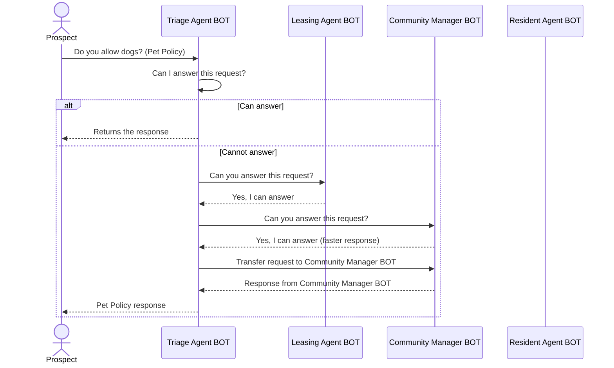

# Topics

- [yaibot.rekindle](#YAIBOT.REKINDLE)
- [Student Housing](#STUDENT-HOUSING)
- [yaibot.synergy](#YAIBOT.SYNERGY)
- [yaibot.botverse](#YAIBOT.BOTVERSE)
    - [Current vs Proopsed system](#Current-vs-Proposed-system)
        - [Current System](#Current-System)
        - [Proposed System](#Proposed-System)
            - [Example conversation](#Example-conversation)
            - [Sequence Diagram](#Sequence-Diagram)
    - [Technology](#Techstack-for-BOTVERSE)
- Assistant API
- Automation/Unit Testing

## YAIBOT.REKINDLE

Experimental project codenamed *rekindle* to be presented to Amit, Manish, Jon and Obaid

**Email from Akshai below**
```
On my flight and figured I would bother all of you with the below thought. 
ChatIQ is currently very good at “Read and Respond” which is supremely powerful for our clients. But the but is not particularly concerned with how helpful it is for the Prospect/Resident. 
In my mind the next iteration should evolve to ChatIQ being the Prospect/Residents guide/advocate through the entire process. It should know how you’ve interacted with our Client in the past, follow up on things that may create a “delightful” experience, and then predict the next step and suggest help/guidance for that.
Basically, the evolution is while it’s there to support making our Clients more efficient, it also starts to make the Customer’s experience that much better. 
With that construct, it would be virtually impossible for Elise to compete with us. Because it requires the data we already have.
```

**Requirement based on above email**

- The system should determine if the user is a returning visitor.  
- Utilize the following identifiers:  
  - **Email ID** for interactions via the email channel.  
  - **Phone number** for SMS and voice communications.  
  - **Webchat session details** for web-based chats.  
  - **Voyager Resident ID** for logged-in users.  
  - **Voyager Prospect ID**, when available.  
- **Discussion Point**: Explore additional methods to identify returning users.  
- Save embedded chat history in a Redis vector store during user interactions for future similarity-based searches.  
- Retrieve relevant information from the Redis vector store for returning users to provide tailored suggestions.  
- Incorporate suggestion messages into the chat flow to enhance the user experience.

**Example story**

Sam visits the 'Elite Residency' website and inquires whether the property allows his pet bulldog, Bruno. Unfortunately, Bruno weighs 50 pounds, exceeding the property's pet weight limit of 40 pounds.

Undeterred, Sam searches for another property, 'Chapel Towers,' and sends a text message to their phone number to ask about the availability of a two-bedroom apartment. A chatbot responds, helping Sam find an apartment that meets his criteria and providing all the relevant details.

To Sam's delight, he receives a follow-up message stating: "Great news! Chapel Towers is a pet-friendly property and allows dogs weighing up to 50 pounds. They are happy to welcome Bruno!"

## STUDENT HOUSING

To Consult with the stakeholder to determine which student intents are most relevant from the client demo perspective.

Below are some potential new use cases/intents for student-related features:

- Certification type
    - EPC Rating
    - Council Tax Rating
- Nearby places
- Student ID Verification
- Demographics
- Leasing Specials
- Rentable Items

## YAIBOT.SYNERGY

## YAIBOT.BOTVERSE

Experimental project or concept codenamed *botverse* to be presented to Amit, Manish, Jon and Obaid.

1. **Ecosystem of Bots**: A network of bots, each specialized in specific tasks, working together to achieve specific goals.
2. **Scalability and Modularity**: Highlighting the ability to expand by adding more bots to the system, tailered to different domains or use cases.
3. **Interoperability**: A system where bots communicate or collaborate efficiently, sharing data or functionality.

### Current vs Proposed system

#### Current System

```mermaid
graph TD
    prospect[<img src="data:image/svg+xml;base64,PHN2ZyB4bWxucz0iaHR0cDovL3d3dy53My5vcmcvMjAwMC9zdmciIHdpZHRoPSIyNCIgaGVpZ2h0PSIyNCIgdmlld0JveD0iMCAwIDI0IDI0Ij48Y2lyY2xlIGN4PSI5IiBjeT0iMTMiIHI9IjEuMjUiIGZpbGw9ImN1cnJlbnRDb2xvciIvPjxjaXJjbGUgY3g9IjE1IiBjeT0iMTMiIHI9IjEuMjUiIGZpbGw9ImN1cnJlbnRDb2xvciIvPjxwYXRoIGZpbGw9ImN1cnJlbnRDb2xvciIgZD0iTTIyLjkxIDExLjk2QzIyLjM5IDYuMzIgMTcuNjYgMiAxMiAyUzEuNjEgNi4zMiAxLjA5IDExLjk2bC0uOSA5Ljg2Yy0uMSAxLjE3LjgyIDIuMTggMiAyLjE4aDE5LjYyYzEuMTggMCAyLjEtMS4wMSAxLjk5LTIuMTh6TTQuNTQgOS4xM2MuODcuNTUgMS44OS44NyAyLjk2Ljg3YzEuODYgMCAzLjUtLjkzIDQuNS0yLjM1QzEzIDkuMDcgMTQuNjQgMTAgMTYuNSAxMGMxLjA3IDAgMi4wOS0uMzIgMi45Ni0uODdjLjM0Ljg5LjU0IDEuODYuNTQgMi44N2MwIDQuNDEtMy41OSA4LTggOHMtOC0zLjU5LTgtOGMwLTEuMDEuMi0xLjk4LjU0LTIuODciLz48L3N2Zz4="> Prospect]
    resident[<img src="data:image/svg+xml;base64,PHN2ZyB4bWxucz0iaHR0cDovL3d3dy53My5vcmcvMjAwMC9zdmciIHdpZHRoPSIyNCIgaGVpZ2h0PSIyNCIgdmlld0JveD0iMCAwIDI0IDI0Ij48cGF0aCBmaWxsPSJjdXJyZW50Q29sb3IiIGQ9Ik0xMiAyYy0uOTYgMC0xLjg4LjE0LTIuNzUuMzlBNC45OSA0Ljk5IDAgMCAwIDUgMEMyLjI0IDAgMCAyLjI0IDAgNWMwIDEuOC45NiAzLjM3IDIuMzkgNC4yNUMyLjE0IDEwLjEyIDIgMTEuMDQgMiAxMmMwIDUuNTIgNC40OCAxMCAxMCAxMHMxMC00LjQ4IDEwLTEwUzE3LjUyIDIgMTIgMm0wIDE4Yy00LjQxIDAtOC0zLjU5LTgtOGMwLS4wNS4wMS0uMS4wMS0uMTVjMi42LS45OCA0LjY4LTIuOTkgNS43NC01LjU1YTkuOTQgOS45NCAwIDAgMCA5LjkyIDMuNDZjLjIxLjcxLjMzIDEuNDYuMzMgMi4yNGMwIDQuNDEtMy41OSA4LTggOCIvPjxjaXJjbGUgY3g9IjkiIGN5PSIxMyIgcj0iMS4yNSIgZmlsbD0iY3VycmVudENvbG9yIi8+PGNpcmNsZSBjeD0iMTUiIGN5PSIxMyIgcj0iMS4yNSIgZmlsbD0iY3VycmVudENvbG9yIi8+PC9zdmc+"> Resident]
    student[<img src="data:image/svg+xml;base64,PHN2ZyB4bWxucz0iaHR0cDovL3d3dy53My5vcmcvMjAwMC9zdmciIHdpZHRoPSIyNCIgaGVpZ2h0PSIyNCIgdmlld0JveD0iMCAwIDI0IDI0Ij48cGF0aCBmaWxsPSJjdXJyZW50Q29sb3IiIGQ9Ik0xMiAxOHEzLjM1IDAgNS42NzUtMi4zMzdUMjAgMTBxMC0uNzc1LS4xMjUtMS40ODd0LS40LTEuMzg4cS0uNjc1LjQyNS0xLjQyNS42NVQxNi41IDhxLTEuMzUgMC0yLjUzNy0uNjEyVDEyIDUuNjVxLS43NzUgMS4xMjUtMS45NjMgMS43MzhUNy41IDhxLS44IDAtMS41NS0uMjI1dC0xLjQyNS0uNjVxLS4yNzUuNjc1LS40IDEuMzg4VDQgMTBxMCAzLjMyNSAyLjMzOCA1LjY2M1QxMiAxOG0tMy01Ljc1cS41MjUgMCAuODg4LS4zNjNUMTAuMjUgMTF0LS4zNjMtLjg4OFQ5IDkuNzV0LS44ODguMzYzVDcuNzUgMTF0LjM2My44ODh0Ljg4Ny4zNjJtNiAwcS41MjUgMCAuODg4LS4zNjNUMTYuMjUgMTF0LS4zNjMtLjg4OFQxNSA5Ljc1dC0uODg4LjM2M3QtLjM2Mi44ODd0LjM2My44ODh0Ljg4Ny4zNjJNNy41IDZxMS40NSAwIDIuNDc1LTEuMDI1VDExIDIuNXYtLjQ1cS0xLjcuMi0zLjEyNSAxLjA3NVQ1LjUgNS4zNXEuNDUuMy45NS40NzVUNy41IDZtOSAwcS41NSAwIDEuMDUtLjE2M3QuOTUtLjQ4N1ExNy41NSA0IDE2LjEzNyAzLjEyNVQxMyAyLjA1di40NXEwIDEuNDUgMS4wMjUgMi40NzVUMTYuNSA2TTAgMjJMMS4xIDkuOTVxLjItMi4xIDEuMTM4LTMuOTI1dDIuNC0zLjE2M3QzLjM1LTIuMVQxMiAwdDQuMDEzLjc2M3QzLjM1IDIuMXQyLjQgMy4xNjJUMjIuOSA5Ljk1TDI0IDIyem0xMi0ycS0zLjEyNSAwLTUuNjI1LTEuNzM3VDIuNzUgMTMuOEwyLjIgMjBoMTkuNmwtLjU1LTYuMnEtMS4xMjUgMi43MjUtMy42MTMgNC40NjNUMTIgMjBtMCAwaDkuOEgyLjJ6Ii8+PC9zdmc+"> Student]
    subgraph BOT
    leasing[Leasing Intents]
    residential[Resident Intents]
    affordable[Affordable Intents]
    studentintents[Student Intents]
    commonintents[Common Intents]
    customintents[Custom Intents]
    end

    prospect -->|schedule a tour| leasing
    resident -->|my balance due| residential
    student -->|instalment schedule| studentintents
    prospect -->|Hi| commonintents
    resident -->|Hi| commonintents
    student -->|Hi| commonintents
    prospect -->|Covid guidelines| customintents
    resident -->|24 hr security| customintents
    student -->|market nearby| customintents

```



#### Proposed System

```mermaid
graph TD
    prospect[Prospect<br>Tenant]
    resident[<img src="data:image/svg+xml;base64,PHN2ZyB4bWxucz0iaHR0cDovL3d3dy53My5vcmcvMjAwMC9zdmciIHdpZHRoPSIyNCIgaGVpZ2h0PSIyNCIgdmlld0JveD0iMCAwIDI0IDI0Ij48cGF0aCBmaWxsPSJjdXJyZW50Q29sb3IiIGQ9Ik0xMiAyYy0uOTYgMC0xLjg4LjE0LTIuNzUuMzlBNC45OSA0Ljk5IDAgMCAwIDUgMEMyLjI0IDAgMCAyLjI0IDAgNWMwIDEuOC45NiAzLjM3IDIuMzkgNC4yNUMyLjE0IDEwLjEyIDIgMTEuMDQgMiAxMmMwIDUuNTIgNC40OCAxMCAxMCAxMHMxMC00LjQ4IDEwLTEwUzE3LjUyIDIgMTIgMm0wIDE4Yy00LjQxIDAtOC0zLjU5LTgtOGMwLS4wNS4wMS0uMS4wMS0uMTVjMi42LS45OCA0LjY4LTIuOTkgNS43NC01LjU1YTkuOTQgOS45NCAwIDAgMCA5LjkyIDMuNDZjLjIxLjcxLjMzIDEuNDYuMzMgMi4yNGMwIDQuNDEtMy41OSA4LTggOCIvPjxjaXJjbGUgY3g9IjkiIGN5PSIxMyIgcj0iMS4yNSIgZmlsbD0iY3VycmVudENvbG9yIi8+PGNpcmNsZSBjeD0iMTUiIGN5PSIxMyIgcj0iMS4yNSIgZmlsbD0iY3VycmVudENvbG9yIi8+PC9zdmc+" width="20" height="20"> Resident]
    student[<img src="data:image/svg+xml;base64,PHN2ZyB4bWxucz0iaHR0cDovL3d3dy53My5vcmcvMjAwMC9zdmciIHdpZHRoPSIyNCIgaGVpZ2h0PSIyNCIgdmlld0JveD0iMCAwIDI0IDI0Ij48cGF0aCBmaWxsPSJjdXJyZW50Q29sb3IiIGQ9Ik0xMiAxOHEzLjM1IDAgNS42NzUtMi4zMzdUMjAgMTBxMC0uNzc1LS4xMjUtMS40ODd0LS40LTEuMzg4cS0uNjc1LjQyNS0xLjQyNS42NVQxNi41IDhxLTEuMzUgMC0yLjUzNy0uNjEyVDEyIDUuNjVxLS43NzUgMS4xMjUtMS45NjMgMS43MzhUNy41IDhxLS44IDAtMS41NS0uMjI1dC0xLjQyNS0uNjVxLS4yNzUuNjc1LS40IDEuMzg4VDQgMTBxMCAzLjMyNSAyLjMzOCA1LjY2M1QxMiAxOG0tMy01Ljc1cS41MjUgMCAuODg4LS4zNjNUMTAuMjUgMTF0LS4zNjMtLjg4OFQ5IDkuNzV0LS44ODguMzYzVDcuNzUgMTF0LjM2My44ODh0Ljg4Ny4zNjJtNiAwcS41MjUgMCAuODg4LS4zNjNUMTYuMjUgMTF0LS4zNjMtLjg4OFQxNSA5Ljc1dC0uODg4LjM2M3QtLjM2Mi44ODd0LjM2My44ODh0Ljg4Ny4zNjJNNy41IDZxMS40NSAwIDIuNDc1LTEuMDI1VDExIDIuNXYtLjQ1cS0xLjcuMi0zLjEyNSAxLjA3NVQ1LjUgNS4zNXEuNDUuMy45NS40NzVUNy41IDZtOSAwcS41NSAwIDEuMDUtLjE2M3QuOTUtLjQ4N1ExNy41NSA0IDE2LjEzNyAzLjEyNVQxMyAyLjA1di40NXEwIDEuNDUgMS4wMjUgMi40NzVUMTYuNSA2TTAgMjJMMS4xIDkuOTVxLjItMi4xIDEuMTM4LTMuOTI1dDIuNC0zLjE2M3QzLjM1LTIuMVQxMiAwdDQuMDEzLjc2M3QzLjM1IDIuMXQyLjQgMy4xNjJUMjIuOSA5Ljk1TDI0IDIyem0xMi0ycS0zLjEyNSAwLTUuNjI1LTEuNzM3VDIuNzUgMTMuOEwyLjIgMjBoMTkuNmwtLjU1LTYuMnEtMS4xMjUgMi43MjUtMy42MTMgNC40NjNUMTIgMjBtMCAwaDkuOEgyLjJ6Ii8+PC9zdmc+" width="20" height="20"> Prospect<br>Student]
    agentbot[<img src="data:image/svg+xml;base64,PHN2ZyB4bWxucz0iaHR0cDovL3d3dy53My5vcmcvMjAwMC9zdmciIHdpZHRoPSIyNCIgaGVpZ2h0PSIyNCIgdmlld0JveD0iMCAwIDI0IDI0Ij48cGF0aCBmaWxsPSJjdXJyZW50Q29sb3IiIGQ9Ik0xMSAyMXYtMmg4di03LjFxMC0yLjkyNS0yLjAzNy00Ljk2MlQxMiA0LjlUNy4wMzggNi45MzhUNSAxMS45VjE4SDRxLS44MjUgMC0xLjQxMi0uNTg3VDIgMTZ2LTJxMC0uNTI1LjI2My0uOTg3VDMgMTIuMjc1bC4wNzUtMS4zMjVxLjItMS43Ljk4OC0zLjE1dDEuOTc1LTIuNTI1VDguNzYyIDMuNlQxMiAzdDMuMjI1LjZ0Mi43MjUgMS42NjN0MS45NzUgMi41MTJ0MSAzLjE1bC4wNzUgMS4zcS40NzUuMjI1LjczOC42NzV0LjI2Mi45NXYyLjNxMCAuNS0uMjYyLjk1dC0uNzM4LjY3NVYxOXEwIC44MjUtLjU4NyAxLjQxM1QxOSAyMXptLTItN3EtLjQyNSAwLS43MTItLjI4OFQ4IDEzdC4yODgtLjcxMlQ5IDEydC43MTMuMjg4VDEwIDEzdC0uMjg4LjcxM1Q5IDE0bTYgMHEtLjQyNSAwLS43MTItLjI4OFQxNCAxM3QuMjg4LS43MTJUMTUgMTJ0LjcxMy4yODhUMTYgMTN0LS4yODguNzEzVDE1IDE0bS04Ljk3NS0xLjU1UTUuODUgOS44IDcuNjI1IDcuOVQxMi4wNSA2cTIuMjI1IDAgMy45MTMgMS40MTJUMTggMTEuMDI2UTE1LjcyNSAxMSAxMy44MTMgOS44dC0yLjkzOC0zLjI1cS0uNCAyLTEuNjg3IDMuNTYzVDYuMDI1IDEyLjQ1Ii8+PC9zdmc+" width="20" height="20"> Triage<br>Agent<br>BOT]
    leasingagentbot[<img src="data:image/svg+xml;base64,PHN2ZyB4bWxucz0iaHR0cDovL3d3dy53My5vcmcvMjAwMC9zdmciIHdpZHRoPSIyNCIgaGVpZ2h0PSIyNCIgdmlld0JveD0iMCAwIDI0IDI0Ij48cGF0aCBmaWxsPSJjdXJyZW50Q29sb3IiIGQ9Ik0xMSAyMXYtMmg4di03LjFxMC0yLjkyNS0yLjAzNy00Ljk2MlQxMiA0LjlUNy4wMzggNi45MzhUNSAxMS45VjE4SDRxLS44MjUgMC0xLjQxMi0uNTg3VDIgMTZ2LTJxMC0uNTI1LjI2My0uOTg3VDMgMTIuMjc1bC4wNzUtMS4zMjVxLjItMS43Ljk4OC0zLjE1dDEuOTc1LTIuNTI1VDguNzYyIDMuNlQxMiAzdDMuMjI1LjZ0Mi43MjUgMS42NjN0MS45NzUgMi41MTJ0MSAzLjE1bC4wNzUgMS4zcS40NzUuMjI1LjczOC42NzV0LjI2Mi45NXYyLjNxMCAuNS0uMjYyLjk1dC0uNzM4LjY3NVYxOXEwIC44MjUtLjU4NyAxLjQxM1QxOSAyMXptLTItN3EtLjQyNSAwLS43MTItLjI4OFQ4IDEzdC4yODgtLjcxMlQ5IDEydC43MTMuMjg4VDEwIDEzdC0uMjg4LjcxM1Q5IDE0bTYgMHEtLjQyNSAwLS43MTItLjI4OFQxNCAxM3QuMjg4LS43MTJUMTUgMTJ0LjcxMy4yODhUMTYgMTN0LS4yODguNzEzVDE1IDE0bS04Ljk3NS0xLjU1UTUuODUgOS44IDcuNjI1IDcuOVQxMi4wNSA2cTIuMjI1IDAgMy45MTMgMS40MTJUMTggMTEuMDI2UTE1LjcyNSAxMSAxMy44MTMgOS44dC0yLjkzOC0zLjI1cS0uNCAyLTEuNjg3IDMuNTYzVDYuMDI1IDEyLjQ1Ii8+PC9zdmc+" width="20" height="20"> Leasing<br>Agent<br>BOT]

    convleasingagentbot[<img src="data:image/svg+xml;base64,PHN2ZyB4bWxucz0iaHR0cDovL3d3dy53My5vcmcvMjAwMC9zdmciIHdpZHRoPSIyNCIgaGVpZ2h0PSIyNCIgdmlld0JveD0iMCAwIDI0IDI0Ij48cGF0aCBmaWxsPSJjdXJyZW50Q29sb3IiIGQ9Ik0xMSAyMXYtMmg4di03LjFxMC0yLjkyNS0yLjAzNy00Ljk2MlQxMiA0LjlUNy4wMzggNi45MzhUNSAxMS45VjE4SDRxLS44MjUgMC0xLjQxMi0uNTg3VDIgMTZ2LTJxMC0uNTI1LjI2My0uOTg3VDMgMTIuMjc1bC4wNzUtMS4zMjVxLjItMS43Ljk4OC0zLjE1dDEuOTc1LTIuNTI1VDguNzYyIDMuNlQxMiAzdDMuMjI1LjZ0Mi43MjUgMS42NjN0MS45NzUgMi41MTJ0MSAzLjE1bC4wNzUgMS4zcS40NzUuMjI1LjczOC42NzV0LjI2Mi45NXYyLjNxMCAuNS0uMjYyLjk1dC0uNzM4LjY3NVYxOXEwIC44MjUtLjU4NyAxLjQxM1QxOSAyMXptLTItN3EtLjQyNSAwLS43MTItLjI4OFQ4IDEzdC4yODgtLjcxMlQ5IDEydC43MTMuMjg4VDEwIDEzdC0uMjg4LjcxM1Q5IDE0bTYgMHEtLjQyNSAwLS43MTItLjI4OFQxNCAxM3QuMjg4LS43MTJUMTUgMTJ0LjcxMy4yODhUMTYgMTN0LS4yODguNzEzVDE1IDE0bS04Ljk3NS0xLjU1UTUuODUgOS44IDcuNjI1IDcuOVQxMi4wNSA2cTIuMjI1IDAgMy45MTMgMS40MTJUMTggMTEuMDI2UTE1LjcyNSAxMSAxMy44MTMgOS44dC0yLjkzOC0zLjI1cS0uNCAyLTEuNjg3IDMuNTYzVDYuMDI1IDEyLjQ1Ii8+PC9zdmc+" width="20" height="20"> Conventional<br>Leasing<br>Agent<br>BOT]

    stuleasingagentbot[<img src="data:image/svg+xml;base64,PHN2ZyB4bWxucz0iaHR0cDovL3d3dy53My5vcmcvMjAwMC9zdmciIHdpZHRoPSIyNCIgaGVpZ2h0PSIyNCIgdmlld0JveD0iMCAwIDI0IDI0Ij48cGF0aCBmaWxsPSJjdXJyZW50Q29sb3IiIGQ9Ik0xMSAyMXYtMmg4di03LjFxMC0yLjkyNS0yLjAzNy00Ljk2MlQxMiA0LjlUNy4wMzggNi45MzhUNSAxMS45VjE4SDRxLS44MjUgMC0xLjQxMi0uNTg3VDIgMTZ2LTJxMC0uNTI1LjI2My0uOTg3VDMgMTIuMjc1bC4wNzUtMS4zMjVxLjItMS43Ljk4OC0zLjE1dDEuOTc1LTIuNTI1VDguNzYyIDMuNlQxMiAzdDMuMjI1LjZ0Mi43MjUgMS42NjN0MS45NzUgMi41MTJ0MSAzLjE1bC4wNzUgMS4zcS40NzUuMjI1LjczOC42NzV0LjI2Mi45NXYyLjNxMCAuNS0uMjYyLjk1dC0uNzM4LjY3NVYxOXEwIC44MjUtLjU4NyAxLjQxM1QxOSAyMXptLTItN3EtLjQyNSAwLS43MTItLjI4OFQ4IDEzdC4yODgtLjcxMlQ5IDEydC43MTMuMjg4VDEwIDEzdC0uMjg4LjcxM1Q5IDE0bTYgMHEtLjQyNSAwLS43MTItLjI4OFQxNCAxM3QuMjg4LS43MTJUMTUgMTJ0LjcxMy4yODhUMTYgMTN0LS4yODguNzEzVDE1IDE0bS04Ljk3NS0xLjU1UTUuODUgOS44IDcuNjI1IDcuOVQxMi4wNSA2cTIuMjI1IDAgMy45MTMgMS40MTJUMTggMTEuMDI2UTE1LjcyNSAxMSAxMy44MTMgOS44dC0yLjkzOC0zLjI1cS0uNCAyLTEuNjg3IDMuNTYzVDYuMDI1IDEyLjQ1Ii8+PC9zdmc+" width="20" height="20"> Student<br>Leasing<br>Agent<br>BOT]

    communitybot[<img src="data:image/svg+xml;base64,PHN2ZyB4bWxucz0iaHR0cDovL3d3dy53My5vcmcvMjAwMC9zdmciIHdpZHRoPSIyNCIgaGVpZ2h0PSIyNCIgdmlld0JveD0iMCAwIDI0IDI0Ij48cGF0aCBmaWxsPSJjdXJyZW50Q29sb3IiIGQ9Ik0xMSAyMXYtMmg4di03LjFxMC0yLjkyNS0yLjAzNy00Ljk2MlQxMiA0LjlUNy4wMzggNi45MzhUNSAxMS45VjE4SDRxLS44MjUgMC0xLjQxMi0uNTg3VDIgMTZ2LTJxMC0uNTI1LjI2My0uOTg3VDMgMTIuMjc1bC4wNzUtMS4zMjVxLjItMS43Ljk4OC0zLjE1dDEuOTc1LTIuNTI1VDguNzYyIDMuNlQxMiAzdDMuMjI1LjZ0Mi43MjUgMS42NjN0MS45NzUgMi41MTJ0MSAzLjE1bC4wNzUgMS4zcS40NzUuMjI1LjczOC42NzV0LjI2Mi45NXYyLjNxMCAuNS0uMjYyLjk1dC0uNzM4LjY3NVYxOXEwIC44MjUtLjU4NyAxLjQxM1QxOSAyMXptLTItN3EtLjQyNSAwLS43MTItLjI4OFQ4IDEzdC4yODgtLjcxMlQ5IDEydC43MTMuMjg4VDEwIDEzdC0uMjg4LjcxM1Q5IDE0bTYgMHEtLjQyNSAwLS43MTItLjI4OFQxNCAxM3QuMjg4LS43MTJUMTUgMTJ0LjcxMy4yODhUMTYgMTN0LS4yODguNzEzVDE1IDE0bS04Ljk3NS0xLjU1UTUuODUgOS44IDcuNjI1IDcuOVQxMi4wNSA2cTIuMjI1IDAgMy45MTMgMS40MTJUMTggMTEuMDI2UTE1LjcyNSAxMSAxMy44MTMgOS44dC0yLjkzOC0zLjI1cS0uNCAyLTEuNjg3IDMuNTYzVDYuMDI1IDEyLjQ1Ii8+PC9zdmc+" width="20" height="20"> Community<br>Manager<br>BOT]

    tourscheduler[<img src="data:image/svg+xml;base64,PHN2ZyB4bWxucz0iaHR0cDovL3d3dy53My5vcmcvMjAwMC9zdmciIHdpZHRoPSIyNCIgaGVpZ2h0PSIyNCIgdmlld0JveD0iMCAwIDI0IDI0Ij48cGF0aCBmaWxsPSJjdXJyZW50Q29sb3IiIGQ9Ik0xMSAyMXYtMmg4di03LjFxMC0yLjkyNS0yLjAzNy00Ljk2MlQxMiA0LjlUNy4wMzggNi45MzhUNSAxMS45VjE4SDRxLS44MjUgMC0xLjQxMi0uNTg3VDIgMTZ2LTJxMC0uNTI1LjI2My0uOTg3VDMgMTIuMjc1bC4wNzUtMS4zMjVxLjItMS43Ljk4OC0zLjE1dDEuOTc1LTIuNTI1VDguNzYyIDMuNlQxMiAzdDMuMjI1LjZ0Mi43MjUgMS42NjN0MS45NzUgMi41MTJ0MSAzLjE1bC4wNzUgMS4zcS40NzUuMjI1LjczOC42NzV0LjI2Mi45NXYyLjNxMCAuNS0uMjYyLjk1dC0uNzM4LjY3NVYxOXEwIC44MjUtLjU4NyAxLjQxM1QxOSAyMXptLTItN3EtLjQyNSAwLS43MTItLjI4OFQ4IDEzdC4yODgtLjcxMlQ5IDEydC43MTMuMjg4VDEwIDEzdC0uMjg4LjcxM1Q5IDE0bTYgMHEtLjQyNSAwLS43MTItLjI4OFQxNCAxM3QuMjg4LS43MTJUMTUgMTJ0LjcxMy4yODhUMTYgMTN0LS4yODguNzEzVDE1IDE0bS04Ljk3NS0xLjU1UTUuODUgOS44IDcuNjI1IDcuOVQxMi4wNSA2cTIuMjI1IDAgMy45MTMgMS40MTJUMTggMTEuMDI2UTE1LjcyNSAxMSAxMy44MTMgOS44dC0yLjkzOC0zLjI1cS0uNCAyLTEuNjg3IDMuNTYzVDYuMDI1IDEyLjQ1Ii8+PC9zdmc+" width="20" height="20"> Apartment<br>Tour<br>Manager]

    onlineleasing[<img src="data:image/svg+xml;base64,PHN2ZyB4bWxucz0iaHR0cDovL3d3dy53My5vcmcvMjAwMC9zdmciIHdpZHRoPSIyNCIgaGVpZ2h0PSIyNCIgdmlld0JveD0iMCAwIDI0IDI0Ij48cGF0aCBmaWxsPSJjdXJyZW50Q29sb3IiIGQ9Ik0xMSAyMXYtMmg4di03LjFxMC0yLjkyNS0yLjAzNy00Ljk2MlQxMiA0LjlUNy4wMzggNi45MzhUNSAxMS45VjE4SDRxLS44MjUgMC0xLjQxMi0uNTg3VDIgMTZ2LTJxMC0uNTI1LjI2My0uOTg3VDMgMTIuMjc1bC4wNzUtMS4zMjVxLjItMS43Ljk4OC0zLjE1dDEuOTc1LTIuNTI1VDguNzYyIDMuNlQxMiAzdDMuMjI1LjZ0Mi43MjUgMS42NjN0MS45NzUgMi41MTJ0MSAzLjE1bC4wNzUgMS4zcS40NzUuMjI1LjczOC42NzV0LjI2Mi45NXYyLjNxMCAuNS0uMjYyLjk1dC0uNzM4LjY3NVYxOXEwIC44MjUtLjU4NyAxLjQxM1QxOSAyMXptLTItN3EtLjQyNSAwLS43MTItLjI4OFQ4IDEzdC4yODgtLjcxMlQ5IDEydC43MTMuMjg4VDEwIDEzdC0uMjg4LjcxM1Q5IDE0bTYgMHEtLjQyNSAwLS43MTItLjI4OFQxNCAxM3QuMjg4LS43MTJUMTUgMTJ0LjcxMy4yODhUMTYgMTN0LS4yODguNzEzVDE1IDE0bS04Ljk3NS0xLjU1UTUuODUgOS44IDcuNjI1IDcuOVQxMi4wNSA2cTIuMjI1IDAgMy45MTMgMS40MTJUMTggMTEuMDI2UTE1LjcyNSAxMSAxMy44MTMgOS44dC0yLjkzOC0zLjI1cS0uNCAyLTEuNjg3IDMuNTYzVDYuMDI1IDEyLjQ1Ii8+PC9zdmc+" width="20" height="20"> Application<br>Online leasing<br>Manager]

    residentagentbot[<img src="data:image/svg+xml;base64,PHN2ZyB4bWxucz0iaHR0cDovL3d3dy53My5vcmcvMjAwMC9zdmciIHdpZHRoPSIyNCIgaGVpZ2h0PSIyNCIgdmlld0JveD0iMCAwIDI0IDI0Ij48cGF0aCBmaWxsPSJjdXJyZW50Q29sb3IiIGQ9Ik0xMSAyMXYtMmg4di03LjFxMC0yLjkyNS0yLjAzNy00Ljk2MlQxMiA0LjlUNy4wMzggNi45MzhUNSAxMS45VjE4SDRxLS44MjUgMC0xLjQxMi0uNTg3VDIgMTZ2LTJxMC0uNTI1LjI2My0uOTg3VDMgMTIuMjc1bC4wNzUtMS4zMjVxLjItMS43Ljk4OC0zLjE1dDEuOTc1LTIuNTI1VDguNzYyIDMuNlQxMiAzdDMuMjI1LjZ0Mi43MjUgMS42NjN0MS45NzUgMi41MTJ0MSAzLjE1bC4wNzUgMS4zcS40NzUuMjI1LjczOC42NzV0LjI2Mi45NXYyLjNxMCAuNS0uMjYyLjk1dC0uNzM4LjY3NVYxOXEwIC44MjUtLjU4NyAxLjQxM1QxOSAyMXptLTItN3EtLjQyNSAwLS43MTItLjI4OFQ4IDEzdC4yODgtLjcxMlQ5IDEydC43MTMuMjg4VDEwIDEzdC0uMjg4LjcxM1Q5IDE0bTYgMHEtLjQyNSAwLS43MTItLjI4OFQxNCAxM3QuMjg4LS43MTJUMTUgMTJ0LjcxMy4yODhUMTYgMTN0LS4yODguNzEzVDE1IDE0bS04Ljk3NS0xLjU1UTUuODUgOS44IDcuNjI1IDcuOVQxMi4wNSA2cTIuMjI1IDAgMy45MTMgMS40MTJUMTggMTEuMDI2UTE1LjcyNSAxMSAxMy44MTMgOS44dC0yLjkzOC0zLjI1cS0uNCAyLTEuNjg3IDMuNTYzVDYuMDI1IDEyLjQ1Ii8+PC9zdmc+" width="20" height="20"> Resident<br>Agent<br>BOT]

    aragentbot[<img src="data:image/svg+xml;base64,PHN2ZyB4bWxucz0iaHR0cDovL3d3dy53My5vcmcvMjAwMC9zdmciIHdpZHRoPSIyNCIgaGVpZ2h0PSIyNCIgdmlld0JveD0iMCAwIDI0IDI0Ij48cGF0aCBmaWxsPSJjdXJyZW50Q29sb3IiIGQ9Ik0xMSAyMXYtMmg4di03LjFxMC0yLjkyNS0yLjAzNy00Ljk2MlQxMiA0LjlUNy4wMzggNi45MzhUNSAxMS45VjE4SDRxLS44MjUgMC0xLjQxMi0uNTg3VDIgMTZ2LTJxMC0uNTI1LjI2My0uOTg3VDMgMTIuMjc1bC4wNzUtMS4zMjVxLjItMS43Ljk4OC0zLjE1dDEuOTc1LTIuNTI1VDguNzYyIDMuNlQxMiAzdDMuMjI1LjZ0Mi43MjUgMS42NjN0MS45NzUgMi41MTJ0MSAzLjE1bC4wNzUgMS4zcS40NzUuMjI1LjczOC42NzV0LjI2Mi45NXYyLjNxMCAuNS0uMjYyLjk1dC0uNzM4LjY3NVYxOXEwIC44MjUtLjU4NyAxLjQxM1QxOSAyMXptLTItN3EtLjQyNSAwLS43MTItLjI4OFQ4IDEzdC4yODgtLjcxMlQ5IDEydC43MTMuMjg4VDEwIDEzdC0uMjg4LjcxM1Q5IDE0bTYgMHEtLjQyNSAwLS43MTItLjI4OFQxNCAxM3QuMjg4LS43MTJUMTUgMTJ0LjcxMy4yODhUMTYgMTN0LS4yODguNzEzVDE1IDE0bS04Ljk3NS0xLjU1UTUuODUgOS44IDcuNjI1IDcuOVQxMi4wNSA2cTIuMjI1IDAgMy45MTMgMS40MTJUMTggMTEuMDI2UTE1LjcyNSAxMSAxMy44MTMgOS44dC0yLjkzOC0zLjI1cS0uNCAyLTEuNjg3IDMuNTYzVDYuMDI1IDEyLjQ1Ii8+PC9zdmc+" width="20" height="20"> AR<br>Agent<br>BOT]

    maintagentbot[<img src="data:image/svg+xml;base64,PHN2ZyB4bWxucz0iaHR0cDovL3d3dy53My5vcmcvMjAwMC9zdmciIHdpZHRoPSIyNCIgaGVpZ2h0PSIyNCIgdmlld0JveD0iMCAwIDI0IDI0Ij48cGF0aCBmaWxsPSJjdXJyZW50Q29sb3IiIGQ9Ik0xMSAyMXYtMmg4di03LjFxMC0yLjkyNS0yLjAzNy00Ljk2MlQxMiA0LjlUNy4wMzggNi45MzhUNSAxMS45VjE4SDRxLS44MjUgMC0xLjQxMi0uNTg3VDIgMTZ2LTJxMC0uNTI1LjI2My0uOTg3VDMgMTIuMjc1bC4wNzUtMS4zMjVxLjItMS43Ljk4OC0zLjE1dDEuOTc1LTIuNTI1VDguNzYyIDMuNlQxMiAzdDMuMjI1LjZ0Mi43MjUgMS42NjN0MS45NzUgMi41MTJ0MSAzLjE1bC4wNzUgMS4zcS40NzUuMjI1LjczOC42NzV0LjI2Mi45NXYyLjNxMCAuNS0uMjYyLjk1dC0uNzM4LjY3NVYxOXEwIC44MjUtLjU4NyAxLjQxM1QxOSAyMXptLTItN3EtLjQyNSAwLS43MTItLjI4OFQ4IDEzdC4yODgtLjcxMlQ5IDEydC43MTMuMjg4VDEwIDEzdC0uMjg4LjcxM1Q5IDE0bTYgMHEtLjQyNSAwLS43MTItLjI4OFQxNCAxM3QuMjg4LS43MTJUMTUgMTJ0LjcxMy4yODhUMTYgMTN0LS4yODguNzEzVDE1IDE0bS04Ljk3NS0xLjU1UTUuODUgOS44IDcuNjI1IDcuOVQxMi4wNSA2cTIuMjI1IDAgMy45MTMgMS40MTJUMTggMTEuMDI2UTE1LjcyNSAxMSAxMy44MTMgOS44dC0yLjkzOC0zLjI1cS0uNCAyLTEuNjg3IDMuNTYzVDYuMDI1IDEyLjQ1Ii8+PC9zdmc+" width="20" height="20"> Maintenance<br>Manager<br>BOT]
    
    classDef leasingagentbotNode fill:#f9f,stroke:#333,stroke-width:2px;
    class leasingagentbot leasingagentbotNode
    class prospect leasingagentbotNode
    class student leasingagentbotNode
    class convleasingagentbot leasingagentbotNode
    class stuleasingagentbot leasingagentbotNode
    class communitybot leasingagentbotNode
    class tourscheduler leasingagentbotNode
    class onlineleasing leasingagentbotNode
    classDef residentagentbotNode fill:#32a852,stroke:#333,stroke-width:2px;
    class residentagentbot residentagentbotNode
    class resident residentagentbotNode
    class aragentbot residentagentbotNode
    class maintagentbot residentagentbotNode

    prospect --> agentbot
    resident --> agentbot
    student -->|Instalment schedule<br>Pet policy| agentbot
    agentbot -->|Instalment schedule| leasingagentbot
    agentbot --> residentagentbot

    leasingagentbot --> convleasingagentbot
    leasingagentbot -->|Instalment schedule| stuleasingagentbot
    leasingagentbot -->communitybot
    convleasingagentbot --> tourscheduler
    convleasingagentbot --> onlineleasing

    residentagentbot--> aragentbot
    residentagentbot --> maintagentbot

    agentbot -->|Pet policy| communitybot

```



##### Example conversation

*Sample BOT Responsibilities*

| BOT Name                          | Intents                                                                           | Assisted By |
|-----------------------------------| ----------------------------------------------------------------------------------|-|
|Triage Agent BOT                   | affirm, callback, humanhandoff, greet, help, inform, thankful, bot_name, goodbye, officehours  | Leasing Agent BOT. Community Manager BOT, Residential Agent BOT
|Leasing Agent BOT                  | | Conventional Leasing BOT, Student Leasing BOT, Community Manager BOT
|Conventional Leasing BOT           | availability, floorplans, rentableitems, securitydeposit, specialspromotions| Apartment Tour Manager, Application/Online Leasing Manager
|Student Leasing BOT                | instalmentschedule|
|Apartment Tour Manager             | scheduletour, tourtype, canceltour, reschedule_tour|
|Application/Online Leasing Manager | moveincharges, specialpromotions, floorplans, applicationstatus, onlineleasing, applicationfee, applicationinvite, leaseterms, leasingoptions, availability, noticeperioddays |
|Community Manager BOT              | apparmentamenities, propertyemail, communityamenities, propertynumber, propertyreviews, photogallery, petpolicy, mapsdirections|
|Residential Agent BOT              |paymentissue, balancedueissue, residentleaseinfo, residentleaserenewal, updateprofile | AR Agent BOT, Maintenance Manager BOT |
|AR Agent BOT                       |balancedue, partpayment, paymentduedate, paymentsetup, payrent, paysetupverification | |
|Maintenance Manager BOT            |cancelmaintrequest, createmaintrequest | |

1. Initial Request:
    - The Prospect (user) asks the question, "Do you allow dogs?" related to the pet policy.
    - The request is directed to the Triage Agent BOT.
2. Self-Assessment:
    - The Triage Agent BOT evaluates whether it can answer the request on its own.
    - If it can answer, the response is sent back to the Prospect, ending the interaction.
3. Delegation to Team:
    - If the Triage Agent BOT cannot answer, it checks with other BOTs on its team:
        - Leasing Agent BOT
        - Community Manager BOT
        - Resident Agent BOT
4. Answer Capabilities:
    - The Leasing Agent BOT and Community Manager BOT can answer the request.
    - However, the Community Manager BOT is identified as the faster responder.
5. Response Handling:
    - The Triage Agent BOT transfers the request to the Community Manager BOT.
    - The Community Manager BOT formulates the response and sends it to the Triage Agent BOT.
6. Response Relay:
    - The Triage Agent BOT forwards the final response back to the Prospect.

##### Sequence Diagram


### Techstack for BOTVERSE
- OpenAI Swarm/CrewAI/LanGraph \
    Swarm focuses on making agent coordination and execution lightweight, highly controllable, and easily testable. \
    It accomplishes this through two primitive abstractions: Agents and handoffs. An Agent encompasses instructions and tools, and can at any point choose to hand off a conversation to another Agent. \
    These primitives are powerful enough to express rich dynamics between tools and networks of agents, allowing you to build scalable, real-world solutions while avoiding a steep learning curve.


